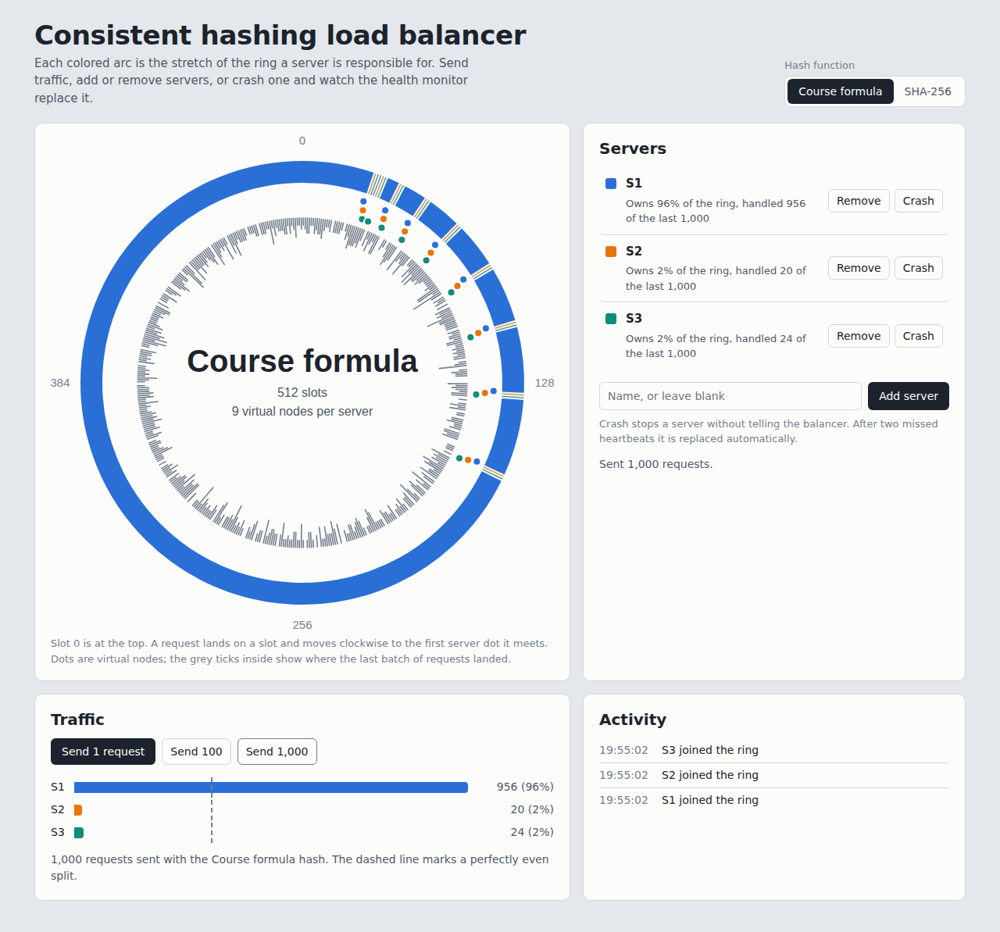
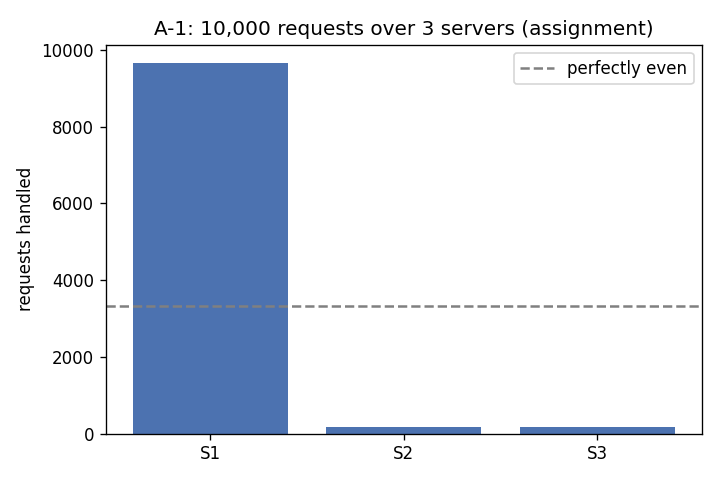

# Consistent Hashing Load Balancer

A load balancer written in Python and Flask that spreads HTTP requests across
several server replicas using a **consistent hash ring**. Replicas run as
Docker containers, can be added or removed through a small REST API, and are
automatically replaced when they stop responding to heartbeats.

## Features

- 512-slot consistent hash ring with 9 virtual replicas per server
- Collision handling with quadratic probing (linear fallback)
- REST API to list, add and remove replicas at runtime
- Background heartbeat monitor that replaces failed replicas and keeps N constant
- Two run modes: Docker containers, or plain local processes (no Docker needed)
- Pluggable hash functions, with an analysis comparing how evenly each spreads load
- Browser dashboard for testing and demos: live hash ring, traffic split, crash recovery
- 35 unit and API tests that run without Docker

## How it works

```
             client
               |
               v
      +------------------+        heartbeat every 5s
      |  load balancer   | --------------------------+
      |  (Flask, :5000)  |                           |
      +------------------+                           |
        |  hash ring picks a replica                 |
        v            v            v                  v
   +--------+   +--------+   +--------+
   |   S1   |   |   S2   |   |   S3   |   ... (containers on network "lbnet")
   +--------+   +--------+   +--------+
```

Each request gets a random ID. The ID is hashed to one of 512 slots, and the
request goes to the first server found moving clockwise from that slot. Each
server sits on the ring 9 times (its "virtual replicas"), which is meant to
spread load evenly.

The payoff of consistent hashing: when a server is added or removed, only the
requests on the arcs next to its slots move. Everything else keeps going to the
same server. `tests/test_hash_ring.py` checks exactly this.

## Project layout

```
lb/
  hash_ring.py     the consistent hash ring
  app.py           load balancer API + heartbeat monitor
  backends.py      start/stop replicas (Docker or local processes)
  dashboard.py     JSON endpoints used by the dashboard
  static/
    dashboard.html the dashboard page (plain HTML, CSS and JavaScript)
server/
  app.py           the replica web server (/home, /heartbeat)
  Dockerfile
tests/             pytest suite (no Docker needed)
analysis/
  simulate.py      offline load distribution experiments + charts
  load_test.py     fire real requests at a running balancer
Dockerfile         image for the load balancer
docker-compose.yml
```

## Running it

### Option 1: without Docker (quickest)

```bash
python -m venv .venv
# Windows: .venv\Scripts\activate      Mac/Linux: source .venv/bin/activate
pip install -r requirements-dev.txt
python -m lb.app --backend local
```

This starts 3 replicas as local processes and the balancer on
http://localhost:5000. Press Ctrl+C to stop; the replicas are cleaned up.

### Option 2: with Docker

Requires Docker Desktop (or Docker Engine) running.

```bash
docker build -t lb-server ./server
docker compose up --build -d
```

Or simply `make up` if you have `make`. Stop with `docker compose down`.

The balancer container talks to Docker through the mounted
`/var/run/docker.sock`, and starts each replica on the `lbnet` network so it
can reach them by name (for example `http://S1:5000`).

## Dashboard

With the balancer running (either option above), open
**http://localhost:5000/dashboard** in a browser.



What you can do from it:

- **See the ring.** Each colored arc is the part of the 512-slot ring a
  server is responsible for. Dots are virtual nodes. Hover anything for details.
- **Send traffic.** Send 1 request to watch it land on a slot and travel
  clockwise to its server, or send 100 or 1,000 to see how the load splits.
  Grey ticks inside the ring show where requests landed.
- **Switch hash function.** Flip between the course formula and SHA-256 while
  the servers keep running, then send traffic again to compare.
- **Add and remove servers.** Uses the normal `/add` and `/rm` endpoints.
- **Crash a server.** Kills it without telling the balancer. The Activity log
  shows the missed heartbeats and the automatic replacement.

The dashboard only uses a few extra JSON endpoints (`/api/state`,
`/api/send`, `/api/crash`, `/api/mode`), documented in `lb/dashboard.py`.

## API

| Method | Path | Body | What it does |
|---|---|---|---|
| GET | `/rep` | | List replicas |
| POST | `/add` | `{"n": 2, "hostnames": ["S4"]}` | Add `n` replicas; names you do not give are generated |
| DELETE | `/rm` | `{"n": 1, "hostnames": ["S2"]}` | Remove `n` replicas; unnamed ones are chosen at random |
| GET | `/<anything>` | | Forwarded to a replica picked by the hash ring |

Examples (bash):

```bash
curl http://localhost:5000/rep
curl http://localhost:5000/home
curl -X POST http://localhost:5000/add -H "Content-Type: application/json" -d '{"n": 2, "hostnames": ["S4"]}'
curl -X DELETE http://localhost:5000/rm -H "Content-Type: application/json" -d '{"n": 1, "hostnames": ["S4"]}'
```

Examples (PowerShell):

```powershell
Invoke-RestMethod http://localhost:5000/rep
Invoke-RestMethod http://localhost:5000/add -Method Post -ContentType "application/json" -Body '{"n": 2, "hostnames": ["S4"]}'
```

Sample responses:

```json
{"message": {"N": 3, "replicas": ["S1", "S2", "S3"]}, "status": "successful"}
{"message": "Hello from Server: S2", "status": "successful"}
{"message": "<Error> '/nope' endpoint does not exist in server replicas", "status": "failure"}
```

## Failure recovery

A background thread pings every replica's `/heartbeat`. After 2 missed
heartbeats in a row, the replica is taken off the ring and a new one is
started, so the number of replicas stays the same. Try it:

```bash
docker kill S1          # or kill one replica process in local mode
curl http://localhost:5000/rep   # a few seconds later, S1 is replaced
```

Sample log:

```
WARNING S1 missed heartbeat (1/2)
WARNING S1 missed heartbeat (2/2)
WARNING replaced failed replica S1 with server-d90b3
```

## Load analysis

`python analysis/simulate.py` sends 10,000 simulated requests through the
ring and saves charts to `analysis/results/`.

**A-1: 10,000 requests over 3 servers**

| Hash function | S1 | S2 | S3 |
|---|---|---|---|
| Course spec: `H(i) = i + 2i² + 17`, `Φ(i,j) = i + j + 2j² + 25` | 9,647 | 179 | 174 |
| SHA-256 | 3,268 | 2,479 | 4,253 |



**Why the course hash functions are so uneven:** in `Φ(i, j)`, the server ID
`i` only adds a small offset. For every virtual replica `j`, servers 1, 2 and 3
land in three *neighbouring* slots (x, x+1, x+2). Moving clockwise, almost
every gap on the ring ends at server 1's slot, so server 1 gets roughly 96% of
the traffic. Adding more servers does not fix it (see
`analysis/results/a2_assignment.png`): the busiest server still handles over
9,000 of 10,000 requests at N = 6.

Hashing with SHA-256 scatters the virtual replicas across the ring and brings
the busiest server close to its fair share. Switch modes with
`--hash sha256` or `HASH_MODE: sha256` in `docker-compose.yml`.

**A-2: N = 2 to 6** (busiest server out of 10,000 requests)

| N | Course spec | SHA-256 | Perfectly even |
|---|---|---|---|
| 2 | 9,821 | 6,213 | 5,000 |
| 3 | 9,647 | 4,253 | 3,333 |
| 4 | 9,459 | 3,767 | 2,500 |
| 5 | 9,283 | 2,838 | 2,000 |
| 6 | 9,100 | 2,422 | 1,667 |

To measure a live deployment instead: `python analysis/load_test.py`.

## Tests

```bash
python -m pytest -v
```

The API tests swap Docker for a fake backend, so they run anywhere in well
under a second.

## Things I learned / possible next steps

- An empty `ConsistentHashRing` has `len() == 0`, so `ring or default` silently
  replaced a custom ring. Checking `is not None` fixed it (there is a test for it).
- `atexit` does not run on SIGTERM, which is what `docker stop` sends, so the
  balancer now converts SIGTERM into a normal exit to clean up its replicas.
- Next: retry a request on another replica when one fails mid-request, and
  run the balancer behind a production WSGI server such as gunicorn.
